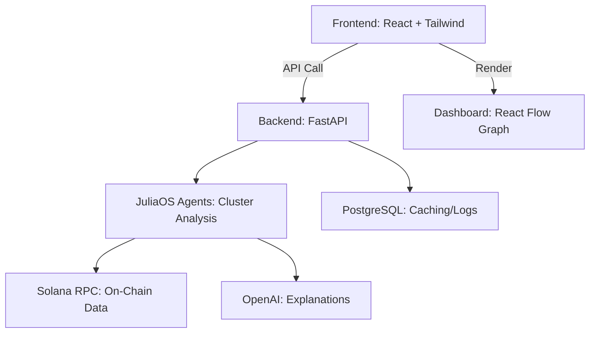

# 🛠️ Ghost Wallet Hunter - Technical Documentation

This document outlines the complete technical architecture and implementation plan for the Ghost Wallet Hunter project, a blockchain analysis tool for detecting suspicious wallet clusters on Solana.

## Table of Contents

1. [Tech Stack](#tech-stack)
2. [Directory Structure](#directory-structure)
3. [Application Flow](#application-flow-mvp-scope)
4. [Required Modules](#required-modules)
5. [Repository & Deployment](#repository--deployment)
6. [Environment Variables](#environment-variables-env)
7. [Development Timeline](#development-timeline-10-days)
8. [Technical Safeguards](#technical--ethical-safeguards)
9. [Future Roadmap](#future-potential-post-mvp-roadmap)

## Tech Stack

### Backend

* **Language:** Python (3.10+)
* **Framework/API:** FastAPI (REST API endpoints)
* **AI Framework:** JuliaOS Agents
* **Blockchain API:** Solana.py (Solana blockchain integration)
* **Database:** PostgreSQL (Render Free-tier)
* **Virtual Environment:** venv
* **Testing:** Pytest

### Frontend

* **Language:** JavaScript/TypeScript
* **Framework/UI:** React.js
* **Styling:** TailwindCSS
* **Graph Visualization:** React Flow
* **API Calls:** Axios

### AI Integration

* **LLM/AI Explanations:** OpenAI API (GPT-3.5/4)

### Tooling

* **Code Editor:** VSCode
* **Version Control:** Git/GitHub
* **API Testing:** Postman/Insomnia
* **Containerization:** Docker (optional)

### Dependencies and Versions

* JuliaOS: v1.11+ ([keep updated](https://github.com/Juliaoscode/JuliaOS))
* FastAPI: 0.100.0+
* Solana.py: 0.32.0+
* React: 18.2.0+
* TailwindCSS: 3.4.0+
* OpenAI SDK: 1.2.0+
* Other dependencies are listed in `requirements.txt` and `package.json`

---

## Directory Structure

```text
ghost-wallet-hunter/
├── backend/
│   ├── agents/
│   ├── api/
│   ├── models/
│   ├── services/
│   ├── tests/
│   ├── main.py
│   ├── requirements.txt
│   └── .env
├── frontend/
│   ├── public/
│   ├── src/
│   │   ├── components/
│   │   ├── pages/
│   │   ├── utils/
│   │   └── App.jsx
│   ├── package.json
│   ├── tailwind.config.js
│   └── .env
├── docs/
│   └── README.md
├── assets/
│   └── demo.gif
└── .gitignore
```

---

## Application Flow (MVP Scope)

Describes the core user journey and processing pipeline for the MVP.

### Ideal User Flow

1. **Input:** User pastes a wallet address or transaction ID.
2. **Backend Analysis:**
   * Request is handled by FastAPI.
   * Backend queries the Solana API.
   * JuliaOS Agent analyzes directly related transactions.
   * Agent builds clusters of linked wallets.
3. **Explanation Generation:**
   * Agent sends parsed transactions to OpenAI.
   * Receives an empathetic, educational explanation.
4. **Frontend Response:**
   * Data is returned to the frontend.
   * Graph is rendered with React Flow.
   * Explanation is shown when clicking on connections.

**Summary:**

* User inputs wallet/transaction.
* FastAPI queries Solana.
* JuliaOS Agent analyzes links.
* Clusters generated.
* OpenAI generates explanations.
* Frontend renders graph + text.

## Backend Request/Response Example

**Endpoint:** `/api/analyze`

**Request:**

```json
{
    "wallet_address": "<solana_wallet_address>"
}
```

**Response:**

```json
{
    "clusters": [
        {"wallet": "Wallet A", "risk": "high"},
        {"wallet": "Wallet B", "risk": "medium"}
    ],
    "explanation": "These wallets are directly connected and often transact simultaneously, indicating potential risk."
}
```

**Field Descriptions:**

* `clusters`: List of wallet clusters with associated risk levels.
* `explanation`: AI-generated summary of the analysis.

## Validation & Error Handling

Endpoints like `/api/analyze` apply strict input validation (e.g., Solana wallet format via regex) and return consistent error messages:

```python
from fastapi import HTTPException

@app.post("/api/analyze")
async def analyze_wallet(wallet_address: str):
    if not is_valid_solana_address(wallet_address):
        raise HTTPException(status_code=422, detail="Invalid Solana address.")
```

## Clustering Criteria: Parameters and Examples

* **Simultaneous Transactions:** Clustered if 3+ mutual transactions occur within 48h.
* **Volume Threshold:** High volume (e.g., X SOL in <24h) increases risk score.
* **Known Patterns:** Wallets linked to mixers/exchanges are tagged.

**Example:**

Wallet A → 5 tx with Wallet B in 12h, 10 SOL → Medium risk cluster

**Detailed Clustering Criteria:**

* A "cluster" = 3+ mutual transactions in last 10 blocks.
* Suspicious: identical-value transactions <1h apart.
* Example: A → B/C/D >3 times in 24h → medium/high risk cluster.

Parameters are adjustable and documented for future updates.

## Redis Caching (Post-MVP Plan)

Planned Redis usage for caching repeated queries and clusters to reduce latency and RPC costs:

* 15-minute TTL per analysis result
* Temporary caching of explanations for frequently queried wallets

---

## Required Modules

This section outlines the essential modules and components needed for each part of the application.

### Backend Components

* **Solana API Module:** Fetches basic transaction and wallet data
* **JuliaOS Agents:** Connection analysis
* **OpenAI Integration:** Generates neutral/empathetic text
* **PostgreSQL:** Logging and basic caching

### Frontend Components

* **Input Module:** Wallet input field
* **Dashboard Module:** Interactive cluster graphs
* **Explanation Module:** Explanation display on node click

### Documentation

* **README:** Install/setup instructions, future roadmap
* **Demo:** GIF/video of basic usage

### Architecture Diagram



*The diagram above illustrates the main data flow between frontend, backend, AI, blockchain, and database components.*

## Repository & Deployment

### Repository Structure

* Single Git repository with separated `frontend/` and `backend/` directories.

### Deployment

* **Backend:** Auto-deploy via Render (from `backend/`)
* **Frontend:** Auto-deploy via Vercel (from `frontend/`)

### Commit/Deploy Flow

* Use commit prefixes like `backend:` or `frontend:`
* Render watches `backend/`, Vercel watches `frontend/`

## Environment Variables (.env)

### Backend Configuration

```env
OPENAI_API_KEY=sk-<your-openai-key>
SOLANA_RPC_URL=https://api.mainnet-beta.solana.com
DATABASE_URL=<postgres-render-connection>
SECRET_KEY=<fastapi-secret-key>
```

### Frontend Configuration

```env
VITE_BACKEND_URL=https://your-backend.onrender.com
```

## Development Timeline (10 Days)

| Day | Task Description |
| --- | --- |
| 1-2 | Environment setup (VSCode, venv, JuliaOS, Solana, Render/Vercel/Postgres) |
| 3-5 | Backend development (Solana API, JuliaOS, AI, PostgreSQL) |
| 6-7 | Frontend development (React, Tailwind, Axios, React Flow) |
| 8-9 | Final integration, basic tests, detailed README |
| 10  | Visual demo (GIF/Video), final adjustments |

## JuliaOS Agent Example (Python Base Class)

```python
class AgentBase:
    def __init__(self, config):
        self.config = config

    def run(self, input_data):
        # Basic agent logic
        return {"result": "Processed data"}
```

> Register agents in `agents_manager.py` as described in the backend README.

## Technical & Ethical Safeguards

* **Accuracy:** Narrow scope to reduce false positives
* **Disclaimers:** Clearly state probabilistic and educational nature
* **Privacy:** Only public on-chain data is used
* **Empathy:** Neutral language, avoids emotional manipulation

## Technical Expansion: Redis Caching

Post-MVP roadmap includes a Redis caching layer:

* Cache analyzed clusters (15min TTL)
* Temporary storage for frequent AI responses

## Future Potential (Post-MVP Roadmap)

* Deep analysis (mixers, bridges)
* Multi-chain support (Ethereum, BSC, etc.)
* Real-time suspicious transaction alerts
* Premium plans for institutional use
* Marketplace for detailed reports
