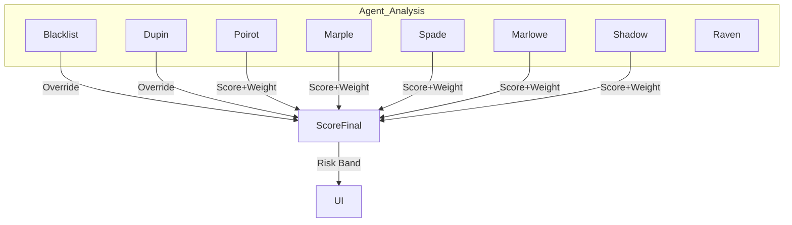

# Risk Scoring System – Full Documentation

## Overview

Ghost Wallet Hunter employs a modular, transparent, and adaptive risk scoring engine that aggregates the specialized analyses of multiple expert agents (the “Detective Squad”). This framework ensures every wallet investigation delivers a robust, explainable, and actionable risk score to end-users. The system is designed to balance forensic precision, adaptability, and user trust.

---

## 1. Scoring System Objectives

- **Reliability:** Scores must reflect the true financial crime risk of a wallet. They must never dilute the threat posed by confirmed malicious actors.
- **Granularity:** Risk is not binary. Each agent delivers a continuous score based on detected red flags, behaviors, and confidence in evidence.
- **Explainability:** Users and analysts see not just the final risk score, but _why_ the result was reached, and which agents flagged concerns.
- **Adaptability:** All logic and weights are easily modifiable to adapt to evolving threats or improvements in detection.

---

## 2. Agent Roles and Scoring Contributions

Each agent performs a unique type of forensic analysis. Each outputs a risk `score`, `confidence`, `verdict`, `tags/flags`, and `key_evidence`.

|Agent|Function|Typical Tags|Output Example|
|---|---|---|---|
|Blacklist|Scam/hack list detection|blacklist|{score: 1.0, verdict: critical, tags: ["blacklist"]}|
|Dupin|AML & compliance|aml_violation, sanctions_pending|{score: 0.95, verdict: high, tags: ["aml_violation"]}|
|Poirot|Transaction analysis|outlier_activity|{score: 0.7, verdict: high, tags: ["outlier_activity"]}|
|Marple|Pattern/anomaly detection|wash_trading|{score: 0.6, verdict: high, tags: ["wash_trading"]}|
|Spade|Overall risk synthesis|multi_evidence|{score: 0.8, verdict: critical, tags: ["multi_evidence"]}|
|Marlowe|Bridge/mixer analysis|bridge_interaction, mixer_interaction|...|
|Shadow|Network/cluster|criminal_cluster|...|
|Raven|LLM explanation|n/a|...|

---

## 3. Agent Weights

Different types of analysis have a different impact on final score. The weights can be adjusted in the codebase as needed.

|Agent|Default Weight|Weight if Critical Flag|
|---|---|---|
|Blacklist|1.5|2.0|
|Dupin|1.3|1.8|
|Spade|1.2|1.4|
|Marple|1.0|1.2|
|Marlowe|0.9|1.2|
|Shadow|0.8|1.1|
|Raven|0.3|0.4|

Blacklist and AML/compliance evidence receive the highest default and critical weights.

---

## 4. Absolute Overrides (Hard Stops)

Certain events force a risk override. These events take precedence over any statistical average, ensuring that confirmed threats are never minimized.

**Override Rules:**

- If Blacklist agent detects a known malicious address (`score >= 0.95`):
  - Final Score: 1.0 (CRITICAL)
  - Verdict: CRITICAL SECURITY ALERT
- If Dupin agent confirms AML/compliance violation (`score >= 0.9`):
  - Final Score: 0.95 (HIGH)
  - Verdict: HIGH THREAT
- If 4+ agents score the wallet above 0.8 (majority consensus):
  - Final Score: 0.9 (HIGH)
  - Verdict: HIGH THREAT

All overrides must be made clear in the user interface.

---

### 5. Dynamic Score Calculation (Normal Scenario)

**Algorithm:**

1. For each agent result:

    - Calculate: `score × weight × (0.7 + 0.3 × confidence)`

2. Sum all weighted scores.

3. Sum all weighted agent weights.

4. Final Score = (Sum of weighted scores) / (Sum of adjusted weights)

5. If total weights = 0, set score to 0.5 (UNKNOWN).

**Majority Override:**

- If 4 or more agents (with valid scores) return `score >= 0.8` and there are at least 6 active agents, apply a majority consensus override: set score to 0.9 and risk to HIGH.

---

### 6. Risk Bands and Severity

|Score|Level|
|---|---|
|0.00-0.29|LOW|
|0.30-0.59|MEDIUM|
|0.60-0.84|HIGH|
|0.85-1.00|CRITICAL|

---

### 7. Agent Confidence Adjustment

- Each agent outputs a `confidence` value (0.0 to 1.0).

- The agent's impact is multiplied by `(0.7 + 0.3 × confidence)`, so uncertain results have less influence.

- Default `confidence` for legacy/incomplete agents is 1.0.

---

### 8. Transparency and Explainability

**Backend must always return:**

- Final score and severity band

- Per-agent: score, confidence, verdict, tags, key evidence

- If any override was applied, which rule triggered it

- List of top contributors to the risk score (by weight × score)

- Human-readable rationale summary

**Frontend must always show:**

- Risk score, color, band

- Banner for critical overrides (blacklist/AML/consensus)

- Per-agent evidence (expandable details)

- Top risk factors/flags (e.g. "Flagged for money laundering by 4 agents.")

---

### 9. Example: Calculation Flow

Suppose 7 agents return:

- Blacklist: score=1.0, confidence=1.0, tag=blacklist

- Dupin: score=0.95, confidence=0.9, tag=aml_violation

- Poirot: score=0.8, confidence=0.7

- Marple: score=0.75, confidence=0.7

- Spade: score=0.8, confidence=0.8

- Marlowe: score=0.7, confidence=0.7

- Shadow: score=0.6, confidence=0.8

**Result:**

- Since Blacklist is 1.0, the override triggers: FINAL SCORE = 1.0 (CRITICAL)

- User sees: "Critical Security Alert – This address is blacklisted (sources: X, Y, Z)"

If no override triggered:

- Weighted sum calculation yields (for example) 0.78 (HIGH)

- User sees: "HIGH RISK – 5 out of 7 agents flagged suspicious activity, evidence includes AML violation, suspicious clustering, and bridge/mixer activity."

---

### 10. Code Snippet – Calculation Logic

```python
def calculate_final_score(agent_results):
    scores = []
    total_weights = 0

    # Hard overrides
    for agent in agent_results:
        if "blacklist" in agent.get("tags", []) and agent["score"] >= 0.95:
            return 1.0, "CRITICAL", ["BLACKLISTED"]
        if "aml_violation" in agent.get("tags", []) and agent["score"] >= 0.9:
            return 0.95, "HIGH", ["AML_VIOLATION"]

    for agent in agent_results:
        score = agent.get("score", None)
        if score is None: continue
        confidence = agent.get("confidence", 1.0)
        weight = agent.get("weight", 1.0)
        weighted_score = score * weight * (0.7 + 0.3 * confidence)
        scores.append(weighted_score)
        total_weights += weight * (0.7 + 0.3 * confidence)

    high_count = sum(1 for agent in agent_results if agent.get("score", 0) >= 0.8)
    if high_count >= 4 and len(agent_results) >= 6:
        return 0.9, "HIGH", ["MAJORITY_CONSENSUS"]

    if total_weights == 0:
        return 0.5, "UNKNOWN", []
    final_score = sum(scores) / total_weights
    if final_score >= 0.85:
        return final_score, "CRITICAL", []
    elif final_score >= 0.60:
        return final_score, "HIGH", []
    elif final_score >= 0.30:
        return final_score, "MEDIUM", []
    else:
        return final_score, "LOW", []
```

---

### 11. Future-Proofing and Extension

- New agent types can be added by assigning an initial weight and tags.

- If a new threat type emerges (e.g. AI-driven phishing, NFT scams), create a specialized agent and calibrate its contribution.

- All logic is centralized and easily configurable in code.

---

### 12. Summary Flowchart


