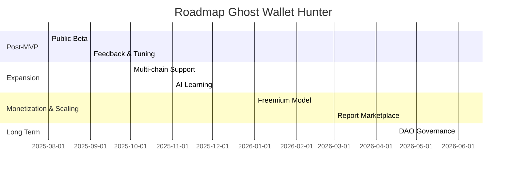

# Ghost Wallet Hunter - Development Roadmap

## Overview

This roadmap outlines the future development of Ghost Wallet Hunter, starting from the current MVP (focused on basic Solana cluster analysis via JuliaOS). The goal is to evolve into a robust, multi-chain, commercially viable tool with measurable milestones. The roadmap is split into short phases (3–6 months), emphasizing community feedback and iteration based on real-world testing.

## Timeline Overview

---

## Phase 1: Post-MVP & Initial Launch (Q3 2025)

**Key Deliverables:**

- Collect user feedback to improve AI precision and reduce false positives.
- Launch open-source public beta and foster an active community.
- Metrics: first 1,000 completed analyses; >30% user retention.
- Initial support for new detection patterns.

**Processes:**

- Feedback via in-app form and GitHub Issues/Discussions.
- Weekly roadmap reviews during the MVP phase.
- Frequent updates with changelog and transparent milestone tracking.

---

## Phase 2: Technical Expansion & Multi-Chain Support (Q4 2025)

**Key Deliverables:**

- Ethereum and BSC support, including cross-chain analysis.
- Continuous AI learning with public fraud datasets.
- Advanced dashboard for historical analysis.
- Metrics: 10,000 active users; strategic partnerships.

**Processes:**

- Open source growth and integration with popular wallets.
- Continuous monitoring of performance and detection accuracy.

---

## Phase 3: Monetization & Scaling (Q1 2026)

**Key Deliverables:**

- Launch freemium model: free basic tier and paid plans with real-time alerts.
- Community-powered custom report marketplace.
- Target: sustainable recurring revenue and integration with exchanges/DAOs.

**Processes:**

- Launch webhook for real-time alerts.
- Ethical compliance and regulatory alignment.

---

## Phase 4: Innovation & Sustainability (Q2 2026+)

**Key Deliverables:**

- Integration of advanced AI agents, expansion to new blockchains.
- DAO governance and community-driven autonomy.
- Goal: 100,000 users; measurable impact in fraud prevention.

**Processes:**

- Educational content (tutorials, webinars).
- Institutional partnerships and continuous regulatory monitoring.

---

## Implementation Notes

- **Team Growth:** Starts solo/community-driven, expands as the open-source project evolves.
- **Infrastructure:** Initial budget for APIs/infra, scaling as needed with project growth.
- **Monitoring:** Public metrics via Google Analytics and GitHub Insights.
- **Review:** Roadmap is updated quarterly based on user feedback.

---

> **Note:** All development is guided by transparency, privacy, and open collaboration. Questions or suggestions? Open an issue or join the GitHub discussion!
