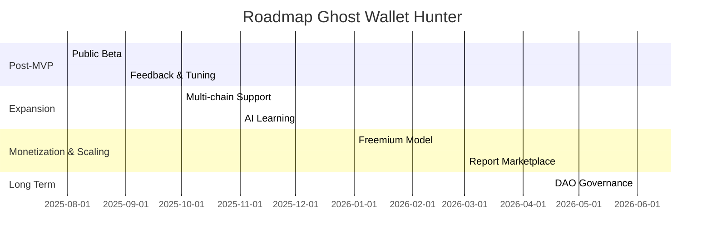

# Ghost Wallet Hunter - Development Roadmap

## Overview

This roadmap outlines the future development of Ghost Wallet Hunter, starting from the current MVP (focused on basic Solana cluster analysis via JuliaOS). The goal is to evolve into a robust, multi-chain, commercially viable tool with measurable milestones. The roadmap is split into short phases (3–6 months), emphasizing community feedback and iteration based on real-world testing.

## Timeline Overview

---

## Phase 1: Post-MVP & Initial Launch (Q3 2025)

### Phase 1 Milestones

* Integrate feedback from Superteam Earn bounty: Improve AI accuracy (e.g., 20% reduction in false positives using public datasets)
* Launch open-source beta on GitHub: Target 500+ stars and 50 initial contributors
* Success Metrics: 1,000 user analyses completed; >30% user retention

### Phase 1 Resources

* Basic alerts via email for premium users (e.g., SendGrid integration)
* Add support for 1–2 new detection patterns (e.g., suspicious bridges)

### Phase 1 Dependencies

* \$3,000 USDT bounty funding for hosting
* Initial Solana community partnerships (e.g., via X/Twitter promotion)

### Phase 1 Risks

* SDK updates in JuliaOS may cause delays — mitigated via weekly testing

#### Continuous Feedback Process

* User feedback collected via in-app form and GitHub Issues/Discussions
* Weekly reviews during MVP phase with rapid hotfix iterations
* Each milestone includes a changelog and updated roadmap

---

## Phase 2: Technical Expansion & Multi-Chain Support (Q4 2025)

### Phase 2 Milestones

* Ethereum and BSC support via Ethers.js and cross-chain analysis
* Continuous AI learning via fine-tuning with fraud datasets (e.g., public Chainalysis reports) — target >90% accuracy
* Success Metrics: 10,000 active users; partnerships with 2–3 exchanges

### Phase 2 Resources

* Advanced dashboard: historical analysis + custom reports
* Wallet integrations (e.g., Phantom) for automated scanning

### Phase 2 Dependencies

* Additional funding (e.g., Solana grants or crowdfunding)
* Open-source contributions for multi-chain support

### Phase 2 Risks

* Technical complexity — mitigated with partial audits (e.g., via Certik)

---

## Phase 3: Monetization & Scaling (Q1 2026)

### Phase 3 Milestones

* Launch freemium model: free basic tier, paid plans with real-time alerts and unlimited reports (target: 500 subscribers)
* Custom report marketplace: users sell analyses, 10% commission model
* Success Metrics: \$5,000+ monthly revenue; integrations with 5+ DAOs/exchanges

### Phase 3 Resources

* Real-time webhook alerts; optional mobile app (React Native)
* Ethical compliance: AI certification (e.g., GDPR and SEC alignment)

### Phase 3 Dependencies

* Aggressive marketing campaign (see Marketing Plan)
* Expanded team (2–3 devs via community contributions)

### Phase 3 Risks

* Competition (e.g., Chainalysis) — mitigated by focusing on decentralization and transparency

---

## Phase 4: Innovation & Sustainability (Q2 2026+)

### Phase 4 Milestones

* Advanced AI agent integration (JuliaOS v2+ swarm); expand to new chains (e.g., Polkadot)
* Autonomous community: DAO-based governance
* Success Metrics: 100,000 users; measurable impact (e.g., \$1M fraud prevention via reports)

### Phase 4 Resources

* Educational content (tutorials, webinars)
* Partnerships with regulators

### Phase 4 Dependencies

* Organic growth; additional funding via token or VC models

### Phase 4 Risks

* Regulatory changes — mitigated through continuous legal monitoring (see Risk Analysis)

---

## Implementation Notes

* **Estimated Budget:** \$10,000 initially (hosting, APIs); scale with revenue
* **Team Growth:** Solo/few contributors initially; grow to 5 members by Phase 3
* **Monitoring Tools:** Google Analytics, GitHub Insights for KPI tracking
* **Review Cycle:** Roadmap updated quarterly based on community feedback
